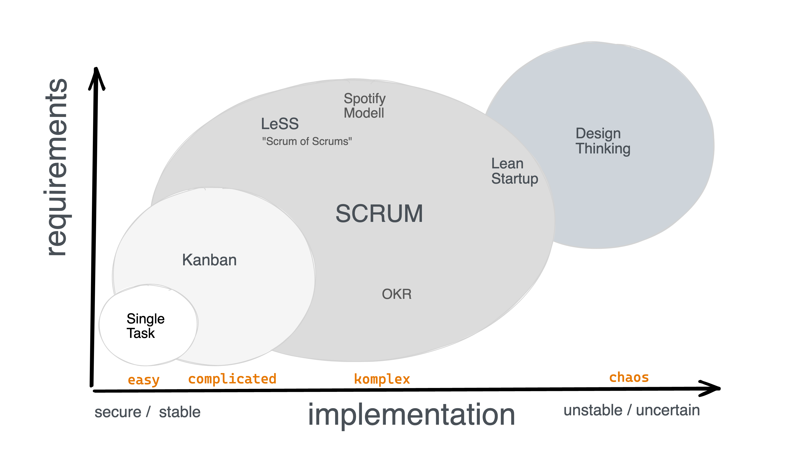
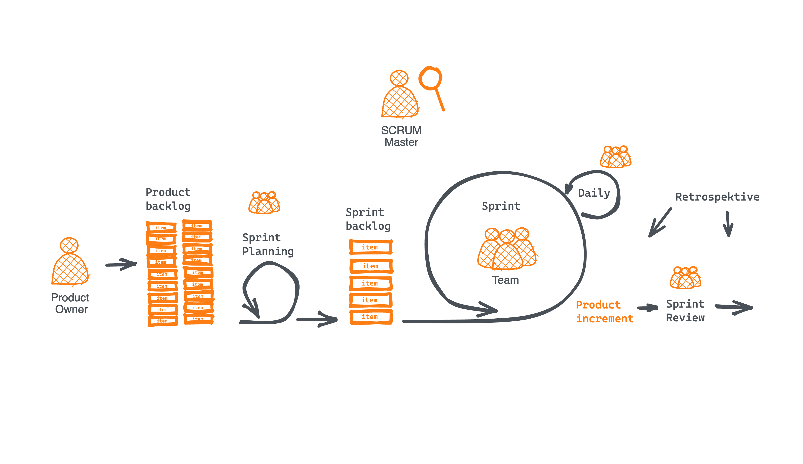
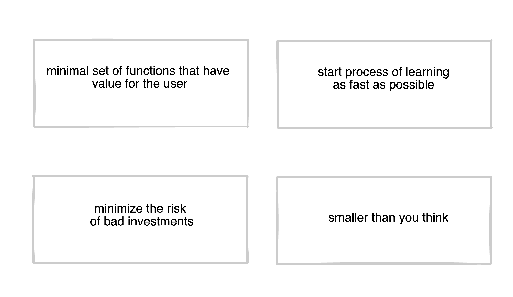
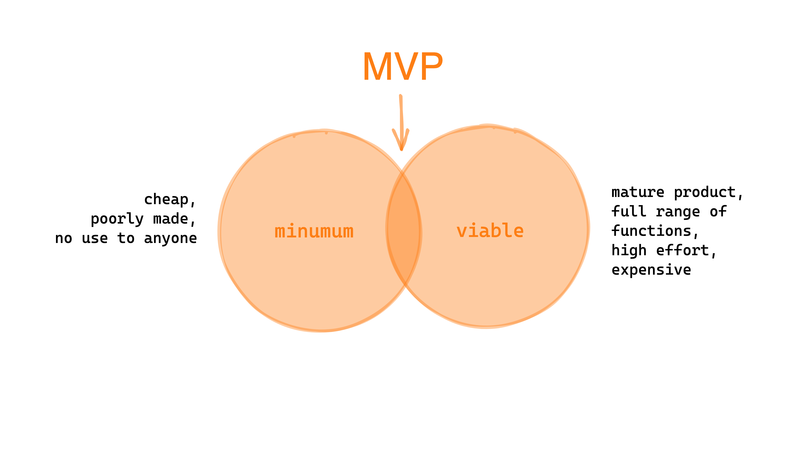
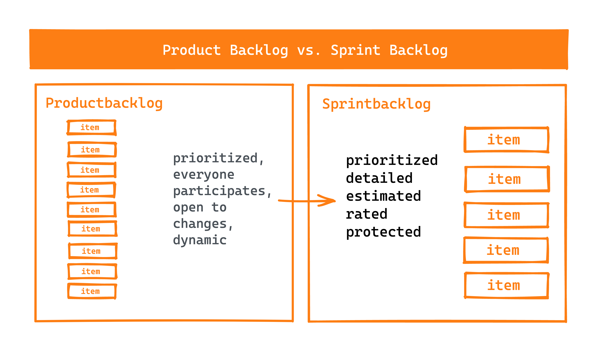

# Agile Workflow und User Stories

## Lernziele

- [ ] Was ist agile & SCRUM
- [ ] Was ist ein MVP
- [ ] Wie organisiert man seinen Backlog
- [ ] Was sind die Scrum-Meetings
- [ ] Wie schreibt man gute User Stories

---

## Agile

Das Wort agile kann einen Prozess bei der Produktentwicklung, eine Struktur innerhalb einer Gruppe oder die gesamte Unternehmenskultur bedeuten. Es geht darum, etwas zu tun (act) - die Ergebnisse schnell zu überprüfen und sich an die Resultate der Iteration anzupassen. Überprüfen und anpassen. Wir entwickeln in Iterationen, überprüfen kontinuierlich die Ergebnisse und passen unsere Vorgehensweise an, um die besten Resultate zu erzielen. Das Gute daran ist, dass wir ausprobieren und scheitern können. Wir sind frei, uns zu ändern, wenn Dinge nicht funktionieren. Am Ende jeder Iteration steht ein funktionierendes Produkt.

Es gibt viele verschiedene Methoden, die wir im agilen Management verwenden können. Das Bild zeigt die wichtigsten agilen Methoden und deren Komplexität sowie Implementierung.


Agile Methoden: Komplexität über Implementierung

- **Single Task**: Eine Person erledigt eine Aufgabe ohne viele Abhängigkeiten zu anderen. Es ist einfach, geradlinig und leicht zu implementieren.
- **Kanban**: Die Aufgaben sind definiert, und man arbeitet sie nacheinander ab. Wenn eine Aufgabe abgeschlossen ist, zieht man die nächste. Der Status der Aufgabe kann auf einem Board (Kanban-Board) von den anderen Teammitgliedern eingesehen werden. An sich ist es nicht komplex, aber kompliziert, wenn es in einer Gruppe verwendet wird.
- **SCRUM**: Eine komplexe Methode im agilen Bereich mit verschiedenen Rollen, Phasen und Events für die Teammitglieder.
- **LeSS**: Large Scale Scrum / "Scrum of Scrums". Skalierter Scrum für größere Teams, die am selben Produkt arbeiten, mit ähnlichen, aber angepassten Prozessen und Events.
- **OKR**: Objective Key Results. Eine Managementmethode, die Ziele für das Team festlegt und iterativ überprüft, ob die Ziele erreicht wurden und angepasst werden müssen.
- **Spotify Modell**: Spotify entwickelte ein Modell, das agil und Scrum-ähnlich für große Teams arbeitet, die am selben Produkt arbeiten.
- **Lean Start-up**: Ein Konzept, um sehr schlank ein neues Produkt zu entwickeln - messen und lernen.
- **Design Thinking**: Eine agile Methode zur Ideenfindung und Problemlösung. Die Idee ist, dass Menschen aus verschiedenen Disziplinen in einem kreativen Umfeld zusammenarbeiten, um die Fragestellung, die Bedürfnisse der Nutzer, die Konzepte und die Testergebnisse zu entwickeln.

---

## SCRUM Überblick


SCRUM

Das Herzstück der Methode ist der **Sprint**. Es handelt sich um eine feste Zeitspanne, in der das Entwicklerteam konsequent an definierten Aufgaben arbeitet. Jeden Tag gibt es ein **Daily Standup**, bei dem jeder seine Fortschritte teilt. Es gibt weitere Events während der Woche für das Team, wie **Sprint-Planung** (wir planen, was in den nächsten Sprint kommt) und **Sprint-Review** (nach jedem Sprint informieren wir die Stakeholder über die Ergebnisse des Sprints).

Nach jedem Sprint gibt es ein finales **Product Increment**. Der **Product Owner** behält den Überblick und ist für den Product Backlog verantwortlich, der **Scrum Master** ist normalerweise kein Teil des Entwicklerteams. Seine/ihre Aufgabe ist es, das Team so effizient wie möglich zu machen. Er/sie prüft, ob wir den Prozess optimieren können, ob die Stimmung im Team gut ist und jeder sich konzentrieren kann.

Die **Retrospektive** zeigt auf, was gut lief, was schlecht lief und was wir für das nächste Mal ändern müssen.

## MVP

**Minimal Viable Product**

Da die Agile-Methodik auf der Validierung und Iteration von Produkten basierend auf Nutzerfeedback aufgebaut ist, spielt das MVP eine zentrale Rolle in der agilen Entwicklung.



Das MVP ist ein Instrument zur Risikominimierung im Verlauf der Produktentwicklung.
Es handelt sich um ein funktionsfähiges Produkt mit minimalen Features, das mit wenig Aufwand erstellt wird, um Kunden- oder Nutzerfeedback zu erhalten.



## Backlog

Es gibt zwei Backlogs zu berücksichtigen: den Product Backlog und den Sprint Backlog. Schau dir das Sprint-Überblicksbild noch einmal an, um den Unterschied zu erkennen.

**Product Backlog**: Der Product Owner ist für den Product Backlog verantwortlich. Dort sind die zu berücksichtigenden Items während der Produktentwicklung aufgelistet. Er ist priorisiert und enthält User Stories, zu denen jeder beitragen kann. Der Product Owner behält den Überblick und weiß, welche Items bald erledigt werden müssen. Die Prioritäten und der Inhalt sind immer offen für Änderungen.

**Sprint Backlog**: Der Sprint Backlog definiert alle User Stories für den nächsten Sprint. Die User Stories sind detailliert und abgeschlossen, priorisiert und festgelegt. Sobald der Sprint begonnen hat, ist der Sprint Backlog geschützt und das Entwicklerteam konzentriert sich auf diese Aufgaben.



## User Stories

**Ziel**: Einen Grund für den Nutzer finden, warum das Feature benötigt wird.

Indem wir einen erwarteten Nutzen für unsere Nutzer definieren, erlauben uns **User Stories**, Anforderungen und Aufgaben festzulegen, die das Team umsetzen muss.

Wertversprechen

```
Als <Akteur> (Nutzer, Autor, eingeloggter Nutzer...)
möchte ich <Feature>
damit <Nutzen>
```

```
As an <actor> (User, Author, logged in User...)
I want a <feature>
So that <benefit>

```

Um gute User Stories zu schreiben, sollte sichergestellt werden, dass sie bestimmten Kriterien entsprechen.
Eine gute User Story folgt den Kriterien, die von Bill Wake als INVEST bezeichnet werden.

I: Independent (Unabhängig)

User Stories sollten unabhängig sein. Es muss sichergestellt werden, dass Änderungen an einer User Story keine Auswirkungen auf eine andere haben. Dies hilft, die Arbeitsbelastung zu reduzieren und die User Stories einfach zu halten.

N: Negotiable (Verhandelbar)

Einer der Hauptzwecke der Erstellung von User Stories ist es, dem Team Flexibilität im Arbeitsprozess zu geben. Daher muss das Projektteam bei der Umsetzung der User Stories freie Hand haben.

V: Valuable (Wertvoll)

Eine User Story, die den Nutzen des Produkts für den Nutzer nicht klar ausdrückt, ist im Wesentlichen wertlos. Beim Erstellen von User Stories muss darauf geachtet werden, dass sie verständlich sind und der Wert des Produkts deutlich wird.

E: Estimable (Schätzbar)

Die Entwicklung der in der User Story hervorgehobenen Ziele sollte messbar sein. Dies ermöglicht es dem Team, Prioritäten und den Arbeitsplan festzulegen.

S: Small (Klein)

User Stories müssen kurz sein. Stories, die mehrere Sprints erfordern, widersprechen dem Zweck einer User Story.

T: Testable (Testbar)

Schließlich muss die User Story ein erreichbares Ziel haben, das getestet werden kann, um zu sehen, ob es den Erwartungen des Nutzers entspricht.

### User Story Vorlage

```md
## Titel

## Wertversprechen

Als <Akteur>
möchte ich <Feature>
damit <Nutzen>

As an <actor>
I want a <feature>
So that <benefit>

## Beschreibung

- Scribble / Design oder Text
- Präzise, keine unnötigen Informationen

## Akzeptanzkriterien

- [ ] Was passiert, wenn ein Eintrag leer ist?
- [ ] Wie sollte sich etwas verhalten?
- [ ] Wie lautet der Text einer Warnmeldung?

## Aufgaben

- [ ] Liste der Aufgaben, die innerhalb des Entwicklungsteams erledigt werden müssen
```

---

## Resources

- [Agile methods](https://www.atlassian.com/de/agile)
- [Userstories](https://cucumber.io/docs/terms/user-story/)
