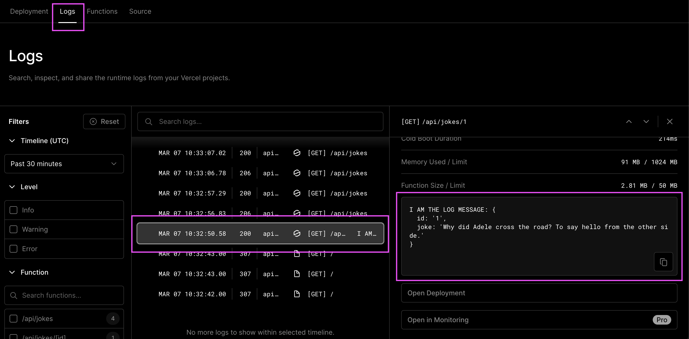

# Backend API-Routen

## Lernziele

- [ ] Wissen, was Serverless Functions sind
- [ ] Verstehen, wofür eine serverseitige API gedacht ist
- [ ] Wissen, wie man Next.js API-Routen implementiert
  - [ ] Statische API-Routen
  - [ ] Dynamische API-Routen
- [ ] Wissen, wie man API-Routen mit `console.log()` debuggt
  - [ ] Auf deinem lokal laufenden Server
  - [ ] Auf einem bereitgestellten Server bei Vercel

---

## Serverless Functions

Es gibt verschiedene Ansätze, Backend-Funktionen für Webanwendungen zu erstellen.

Ein traditioneller Webserver, zum Beispiel gebaut mit dem Node.js-Framework Express, ist ein Programm, das auf einem Server oder einer virtuellen Maschine läuft und auf eingehende HTTP-Anfragen wartet – wie ein Kellner im Restaurant, der darauf wartet, dass Kunden ihre Bestellungen aufgeben. Der Code für den Express-Server wird typischerweise in einer sogenannten monolithischen Struktur geschrieben, in der alle verschiedenen Funktionen und Endpunkte von demselben Programm verwaltet werden.

Im Gegensatz dazu sind Serverless Functions wie kleine Helfer, die nur bei Bedarf ausgeführt werden, also wenn sie benötigt werden. Sie warten auf bestimmte Ereignisse, wie wenn eine Webanwendung eine HTTP-Anfrage erhält oder eine Datenbank aktualisiert wird. Wenn dies passiert, führt die serverlose Funktion ihren Code aus, um die Aufgabe zu erledigen, für die sie programmiert wurde, und wird danach beendet.
Serverless Cloud-Anbieter wie Vercel kümmern sich um alle Details, wie das Einrichten der Computerressourcen, die zum Ausführen des Codes benötigt werden, und das Herunterfahren nach Erledigung der Aufgabe. Es ist, als hätte man ein Team von Köchen, die in die Küche kommen, ein Gericht kochen und dann alles aufräumen, wenn sie fertig sind. Dies macht es Entwicklern leichter, Code zu schreiben, ohne sich um die Verwaltung von Servern oder Ressourcen kümmern zu müssen.

> 💡 Dies ist eine sehr grundlegende Erklärung. Wenn du mehr über Vercel Serverless Functions erfahren möchtest, kannst du hier nachlesen: [Vercel Serverless Functions](https://vercel.com/docs/concepts/functions/serverless-functions)

---

## Wofür eine serverseitige API gedacht ist

Wie wir bereits in der JS Fetch-Sitzung gelernt haben, kann eine API (Application Programming Interface) aus verschiedenen Perspektiven betrachtet werden und auf verschiedenen Ebenen auftreten.

APIs, die in einer Serverumgebung laufen, werden als serverseitige APIs bezeichnet. Sie werden von einem _Server_ bereitgestellt, im Gegensatz zu den APIs, die vom Browser bereitgestellt werden (auch _Client_ genannt). Ein häufiges Anwendungsbeispiel für solche serverseitigen APIs ist das Erstellen, Lesen, Aktualisieren und Löschen von Daten; sogenannte CRUD-Operationen.

> 💡 Sieh dir das Handout der JS Fetch-Sitzung an, um dein API-Wissen aufzufrischen.

Serverless Functions laufen auf einem Server! Aber sie laufen ohne zusätzliche Konfiguration und führen nur den Code aus, der in der Funktion definiert ist.

Beispiel einer serverlosen Funktion in NextJS (z. B. in der Datei `pages/api/dummy/index.js`):

```js
export default function handler(request, response) {
  response.status(200).json({ status: "dummy api call ok!" });
}
```

Nur diese Funktion wird auf dem Server ausgeführt und daher serverless genannt. Die Funktion selbst hat kein Dateisystem oder dauerhaften Speicher, könnte aber eine Datenbank ansprechen, wenn sie wollte.

## Next.js API-Routen

Unser Hauptziel ist es, eine Datenbank zu erstellen und ihre Daten in unserer Webanwendung zu verwalten. Dafür müssen wir unsere eigenen API-Routen innerhalb der Webanwendung erstellen und entscheiden, welche Informationen und Daten die Routen zurückgeben sollen. Zum Glück bietet uns Next.js eine coole Funktion mit einer einfachen und intuitiven Syntax.

Es folgt einer einfachen Ordnerstruktur: Jede Datei im Ordner `pages/api/test/file.js` wird auf den entsprechenden Pfad mit demselben Pfad gemappt, z. B. `/api/test/file`, und wird als API-Endpunkt anstelle einer Seite behandelt.

In Next.js ist eine API-Route einfach ein JavaScript-Modul, das eine Standardfunktion exportiert. Beispielsweise erstellt eine Datei namens `pages/api/hello.js` den API-Endpunkt `/api/hello`, der mit einer JSON-Nachricht "Hello spiced!" antwortet. Die Handler-Funktion nimmt zwei Argumente entgegen: ein Request-Objekt und ein Response-Objekt, die verwendet werden, um das serverlose Programm auf Vercel zu starten, eingehende Anfragen zu bearbeiten und Antworten an den Client zu senden.

```js
export default function handler(request, response) {
  response.status(200).json({ message: "Hello spiced!" });
}
```

> 💡 Weitere Informationen zu [Next.js API Routen](https://nextjs.org/docs/api-routes/introduction).

---

### Dynamische API-Routen

Next.js unterstützt dynamische API-Routen, um API-Endpunkte zu erstellen, die dynamische Parameter im URL-Pfad verarbeiten können, und folgt denselben Namensregeln für Dateien, die auch für Seiten verwendet werden.

Wenn du beispielsweise einen API-Endpunkt erstellen möchtest, der Anfragen für einzelne Witze verarbeiten kann, könntest du eine Datei namens `/pages/api/jokes/[id].js` erstellen. Dies erstellt eine dynamische API-Route, bei der der `id`-Parameter jeden Wert annehmen kann. Wenn du einen einzelnen Witz basierend auf der Witz-ID, die in der Browserroute verwendet wird, abrufen möchtest, können wir den `id`-Routenparameter durch Destrukturierung aus dem `request.query`-Objekt abrufen.

```js
export default function handler(request, response) {
  const { id } = request.query;
  //...
}
```

> 💡 Weitere Informationen zu [Next.js Dynamische API Routen](https://nextjs.org/docs/api-routes/dynamic-api-routes).

### Statische Routen

Erstelle eine statische Route, indem du eine neue Datei unter `pages/api/jokes/index.js` erstellst:

```js
const jokes = []; // fülle das Array oder importiere es von woanders

export default function handler(request, response) {
  response.status(200).json(jokes);
}
```

Dann kannst du deinen ersten privaten API-Endpunkt mit `http://localhost:3000/api/jokes` im Browser aufrufen.

### Dynamische Routen

Erstelle dynamische Routen, indem du eine neue Datei mit eckigen Klammern wie `pages/api/jokes/[id].js` erstellst:

```js
const jokes = [{ id: 0, joke: "nur schlechte Witze hier" }]; // fülle das Array oder importiere es von woanders

export default function handler(request, response) {
  /* the values from query object are always strings and the id from the jokes is a number
   *  -> we need to convert the string to a number with parseInt
   */
  const id = parseInt(request.query.id);
  const joke = jokes.find((j) => j.id === id);
  if (!joke) {
    response.status(404).json({ status: "Witz nicht gefunden" });
    return;
  }
  response.status(200).json(jokes);
}
```

Dann kannst du deine dynamischen privaten API-Routen mit `http://localhost:3000/api/jokes/0` im Browser aufrufen.

## Verwendung privater API-Routen in deiner React-Anwendung

In React kannst du deine privaten API-Routen verwenden, indem du einfach den `useSWR-Hook` wie zuvor verwendest, aber die relative URL übergibst:

```js
const { data } = useSWR(id ? `/api/jokes/${id}` : null);
```

Beachte, dass du **NICHT** den gesamten Host mit `http://localhost:3000` übergeben musst, da du deine Frontend- und Backend-Anwendung in NextJS zusammen betreibst.

## Wie man eine NextJS-App (einschließlich API) bei Vercel bereitstellt

1. Melde dich bei vercel.com mit deinem GitHub-Konto an.
2. Besuche dann https://vercel.com/new, wo du ein Repository aus deinem GitHub-Profil auswählen kannst, das bereitgestellt werden soll. Wähle eines, in dem du eine NextJS-Anwendung hast.
3. Lass im nächsten Bildschirm die Standardeinstellungen unverändert und klicke auf deploy.
4. Warte bis zu 5 Minuten und verwende dann den Link, der dir bereitgestellt wird.
5. Du kannst nun deine gesamte Anwendung einschließlich der definierten API-Routen testen.

## Wie man mit `console.log()` loggt/debuggt

Du kannst die `console.log()`-Funktion verwenden, um deine Webanwendung zu debuggen und zu verstehen, was innerhalb deiner API-Routen passiert. Da die API-Handler auf dem Server ausgeführt werden, wird die Konsolenausgabe in deinem Terminal (localhost) angezeigt, wo du den Entwicklungsserver (`npm run dev`) gestartet hast, oder in der Vercel-Weboberfläche (Vercel-Bereitstellung).

Lokal: Wird im Terminal / Server-Konsole angezeigt


Vercel: Wird in der Weboberfläche angezeigt




> 💡 Weitere Informationen zu [Vercel Runtime Logs](https://vercel.com/docs/concepts/observability/runtime-logs)

Du kannst jederzeit console.log() in der Handler-Funktion verwenden (z. B. in `pages/api/jokes/index.js`). Das Ergebnis siehst du dann im laufenden Terminal, in dem du deine Anwendung mit `npm run dev` gestartet hast. Tipp: Installiere die [Console Ninja](https://marketplace.visualstudio.com/items?itemName=WallabyJs.console-ninja) VSCode-Erweiterung für bessere Lesbarkeit deiner Logs.

### Logging/Debugging für bereitgestellte laufende Server auf Vercel

Du kannst dein Vercel-Dashboard für dein bereitgestelltes Backend aufrufen und dir die Logs ansehen.

## Resources

- [Next.js API Routes](https://nextjs.org/docs/api-routes/introduction)
- [Vercel Serverless Functions](https://vercel.com/docs/concepts/functions/serverless-functions)
- [Vercel Runtime Logs](https://vercel.com/docs/concepts/observability/runtime-logs)
