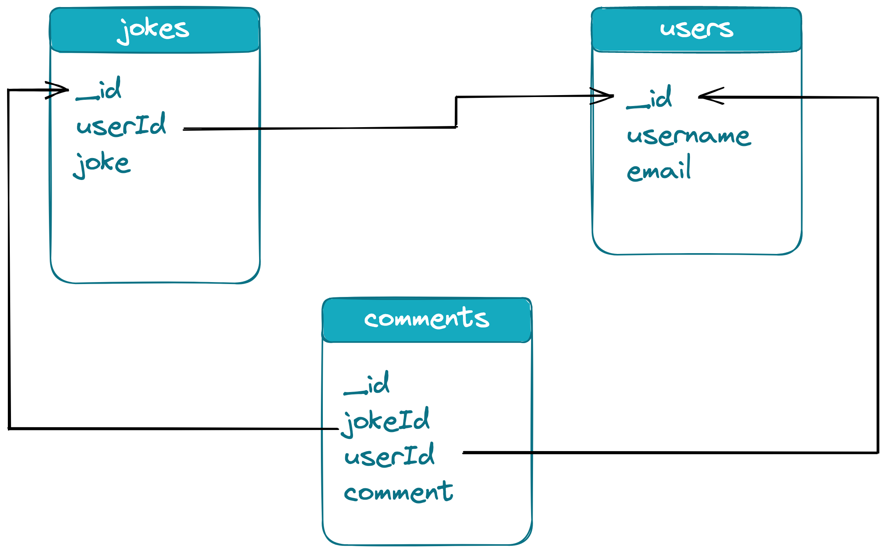

# Backend MongoDB

## Lernziele

- Den Unterschied zwischen einer Datenbank und einem Server verstehen
- Den Unterschied zwischen relationalen und nicht-relationalen Datenbanken kennen
- MongoDB-Grundlagen und wichtige Begriffe verstehen
- Grundwissen im Datenbankdesign erlangen:
  - wie man Sammlungen (Collections) strukturiert (Fremdschlüssel, Referenzen)
  - wie man Dokumente strukturiert (verschachtelte Objekte)
  - Eins-zu-Eins (1:1)
  - Eins-zu-Viele (1:n)
  - Viele-zu-Viele (n:m)
- Wissen, was MongoDB Atlas ist
  - Ein Konto für MongoDB Atlas erstellen
  - Ein Cluster und eine Datenbank erstellen
  - Datenbankbenutzer und Sicherheitseinstellungen einrichten

---

## Einführung: Datenbanken

### Was ist eine Datenbank?

Erinnern wir uns, was ein Server ist:

- ein Programm, das 24/7 läuft und dazu entwickelt wurde, **Dienste für andere Computer oder Geräte bereitzustellen**,
- es kann eine Vielzahl von Diensten hosten, wie z. B. einen Webserver, einen E-Mail-Server, einen Dateiserver oder **einen Datenbankserver**,
- wir haben Next.js API-Routen als Server verwendet, um Daten (aus einer `data.js`-Datei im selben Projekt) zu _servieren_.

Was ist nun ein Datenbankserver?

- es ist ein Programm, das speziell dafür entwickelt wurde, **eine Datenbank zu hosten und zu verwalten**,
- es verwaltet die in der Datenbank gespeicherten Daten,
- es stellt sicher, dass diese Daten für Benutzer und Anwendungen verfügbar sind, die darauf zugreifen müssen,
- Die Datenspeicherung in einer Datenbank ist persistent (dauerhaft).

### Relationale vs. nicht-relationale Datenbanken

Es gibt einige [Unterschiede zwischen relationalen und nicht-relationalen Datenbanken](https://www.mongodb.com/compare/relational-vs-non-relational-databases) (auch bekannt als SQL vs. NoSQL):

**Relational**:

- Daten werden in Tabellen gespeichert (wie in Excel, Numbers, Spreadsheets, …),
- die Tabellen sind miteinander verbunden,
- Einschränkung: Wir müssen für jede Spalte entscheiden, was wir tun, wenn wir keine Daten für alle Einträge in dieser Spalte haben.

**Nicht-relational**:

- Daten werden in JSON-ähnlichen Strukturen gespeichert,
- Daten werden in Schlüssel/Wert-Paaren gespeichert,
- jedes Datenset in der Datenbank kann eindeutige Schlüssel haben.

> 💡 Eine [detaillierte Erklärung und Vergleich findest du hier](https://www.mongodb.com/compare/relational-vs-non-relational-databases).

---

## MongoDB

- Als nicht-relationale Datenbank ist MongoDB weniger strikt und einfach zu bedienen.
- Der Name MongoDB stammt von "hu_mongo_us" \_d_ata_b_ase.
- Der Name wurde gewählt, um die Skalierbarkeit und Flexibilität der Datenbank widerzuspiegeln.

### MongoDB Terminologie

**Datenbank**:

- Eine MongoDB-Datenbank ist eine Sammlung von Daten, die in einer bestimmten Weise organisiert und mit dem MongoDB-Datenbankverwaltungssystem gespeichert wird.
- Eine MongoDB-Datenbank kann mehrere Datensätze enthalten, die _Sammlungen_ (Collections) genannt werden.

**Sammlung (Collection)**:

- Eine Sammlung ist eine Gruppierung von MongoDB-Einträgen, die _Dokumente_ genannt werden.
- Eine Sammlung entspricht einer Tabelle in einem relationalen Datenbanksystem.
- Eine Sammlung existiert innerhalb einer einzelnen Datenbank.

**Dokument**:

- Ein MongoDB-Dokument ist eine _JSON-ähnliche Datenstruktur, die aus Schlüssel-Wert-Paaren besteht_.
- Dokumente können unterschiedliche _Felder_ haben.
- Diese Schlüssel-Wert-Paare werden _Felder_ genannt.

**Feld (Field)**:

- In MongoDB ist ein Feld ein _Schlüssel-Wert-Paar_, das in einem _Dokument_ gespeichert wird.
- Der Feldschlüssel ist eine Zeichenkette, die das Feld identifiziert, und der Feldwert sind die im Feld gespeicherten Daten.

## Datenbankdesign

Allgemeine Richtlinien:

- Gestalte deine Sammlungen und Dokumente um die Daten, die du speichern musst, und um die Abfragen, die du durchführen musst.
- Verwende Arrays, um Listen verwandter Daten innerhalb eines einzelnen Dokuments zu speichern.
- Vermeide tief verschachtelte Datenstrukturen. Wenn deine Dokumente zu komplex werden, beginne, die Daten in mehrere Sammlungen aufzuteilen und die Daten mit Referenzen zu verknüpfen (siehe untenstehendes Beispiel).
- Wenn du auf ein Objekt verweisen möchtest, das in einer anderen Sammlung gespeichert ist, kannst du Fremdschlüssel verwenden:
  - Wenn du eine **Benutzer**-Sammlung und eine **Witze**-Sammlung hast, kannst du einen Fremdschlüssel in der **Witze**-Sammlung verwenden, um eine Referenz auf den Benutzer zu speichern, der jeden Witz erstellt hat.
  - Dies ermöglicht es dir, Informationen über den Benutzer zu speichern, der jeden Witz erstellt hat, ohne Daten in der Witze-Sammlung zu duplizieren.

### Datenbankbeziehungen

Es gibt drei verschiedene Beziehungen zwischen Dokumenten:

**Eins-zu-Eins**:

- Eine Eins-zu-Eins-Beziehung in MongoDB existiert, wenn ein Dokument in einer Sammlung mit genau einem Dokument in einer anderen Sammlung verknüpft ist.
- Dies kann implementiert werden, indem eine Referenz auf das verknüpfte Dokument in einer der beiden Sammlungen gespeichert wird. Die Richtung spielt dabei keine Rolle. Eins-zu-Eins-Beziehungen machen nur in bestimmten speziellen Fällen Sinn. Der Einfachheit halber kannst du darüber nachdenken, die Felder einer Sammlung in die andere hinzuzufügen.

**Eins-zu-Viele**:

- Eine Eins-zu-Viele-Beziehung in MongoDB existiert, wenn ein Dokument in einer Sammlung mit mehreren Dokumenten in einer anderen Sammlung verknüpft ist.
- Dies kann implementiert werden, indem eine Referenz auf das Dokument der "Eins"-Sammlung in den verbundenen Dokumenten der "Viele"-Sammlung gespeichert wird.

**Viele-zu-Viele**:

- Eine Viele-zu-Viele-Beziehung in MongoDB existiert, wenn mehrere Dokumente in einer Sammlung mit mehreren Dokumenten in einer anderen Sammlung verknüpft sind, und umgekehrt.
- Dies wird normalerweise durch das Erstellen einer Zwischen-Sammlung erreicht, deren Dokumente Referenzen auf beide verbundenen Sammlungen enthalten (d. h. sie sind in zwei Eins-zu-Viele-Beziehungen aufgeteilt).

> 📙 Lies mehr über diese [Beziehungen in der MongoDB-Dokumentation](https://www.mongodb.com/docs/manual/tutorial/model-embedded-one-to-one-relationships-between-documents/).

### Beispielvisualisierung

Die folgenden drei Sammlungen visualisieren die oben genannten Best Practices und Beziehungen.



```json5
// Witze-Sammlung:
{
  "_id": ObjectId("joke1ID"),
  "userId": ObjectId("user1ID"),
  "joke": "Warum hassen Programmierer die Natur? Sie hat zu viele Bugs."
}

// Benutzer-Sammlung:
{
  "_id": ObjectId("user1ID"),
  "username": "jane.doe",
  "email": "jane.doe@example.com"
}

// Kommentare-Sammlung:
{
  "_id": ObjectId("comment1ID"),
  "jokeId": ObjectId("joke1ID"),
  "userId": ObjectId("user1ID"),
  "comment": "Der ist gut!"
}
```

Hinweis:

- Jedes Dokument in den Sammlungen hat ein `_id`-Feld, das ein eindeutiger Bezeichner ist.
- Jedes Witzdokument hat ein `joke`-Feld, das den Text des Witzes speichert, und ein `userId`-Feld, das die ID des Benutzers speichert, der den Witz erstellt hat. Dies stellt eine **Eins-zu-Viele**-Beziehung zwischen der Witze- und der Benutzer-Sammlung dar (ein Witz gehört einem Benutzer, aber ein Benutzer kann viele Witze besitzen).

- Jedes Benutzerdokument hat ein `username`-Feld, das den Benutzernamen speichert, und ein `email`-Feld, das die E-Mail-Adresse des Benutzers speichert.

- Jedes Kommentardokument hat ein `jokeId`-Feld, das die ID des Witzes speichert, zu dem der Kommentar gehört, ein `userId`-Feld, das die ID des Benutzers speichert, der den Kommentar erstellt hat, und ein `comment`-Feld, das den Text des Kommentars speichert.
- Das `jokeId`-Feld und das `userId`-Feld implementieren **Eins-zu-Viele**-Beziehungen zwischen den Kommentaren, Witzen und Benutzern, da ein Witz mehrere Kommentare haben kann und ein Benutzer mehrere Kommentare erstellen kann, aber jeder Kommentar kann nur mit einem Witz und einem Benutzer verknüpft sein.

---

## Einführung in MongoDB Atlas

- Wir möchten, dass unsere App über das Internet zugänglich ist.
- Deshalb müssen wir unsere Datenbank über das Internet zugänglich machen.
- Wir sind auf externe Anbieter angewiesen, um unsere Datenbank zu hosten.
- Wir werden MongoDB Atlas verwenden, einen Cloud-Anbieter für Mongo-Datenbanken.

**[Folge den Anweisungen im Challenges-Dokument](./challenges-backend-mongodb.md)**, um deine Datenbank auf MongoDB Atlas einzurichten.

## Ressourcen

- [Unterschiede zwischen relationalen und nicht-relationalen Datenbanken](https://www.mongodb.com/compare/relational-vs-non-relational-databases)
- [Detaillierte Erklärung und Vergleich relational/nicht-relational](https://www.mongodb.com/compare/relational-vs-non-relational-databases)
