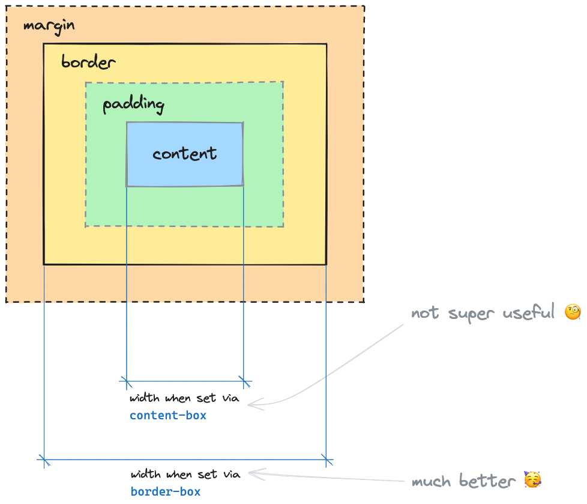
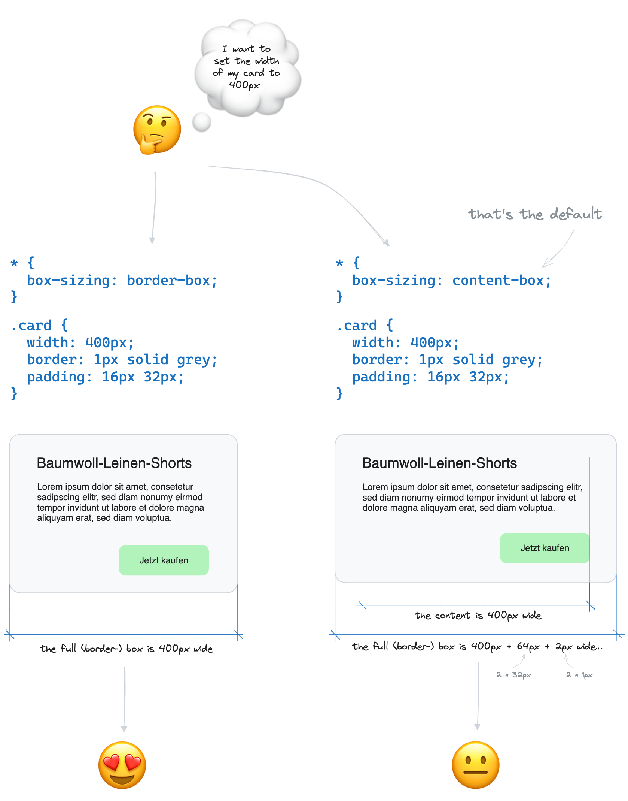

# CSS Grundlagen

## Lernziele

- [ ] Ein allgemeines Verständnis des Zwecks von CSS haben
- [ ] Wissen, was Cascading Style Sheets bedeutet
- [ ] Die Grundlagen von CSS verstehen: CSS-Syntax, Selektoren, Box-Modell, Inline- & Block-Elemente
- [ ] Stylesheets mit dem HTML-Dokument verknüpfen

## Was ist CSS?

Mit CSS (_Cascading Stylesheets_) kannst du deinen HTML-Elementen Styling hinzufügen.


Der Begriff _cascading_ in CSS bezieht sich auf einen Algorithmus, der Konflikte löst, wenn mehrere Styles für ein bestimmtes Element definiert sind. Bei der Entscheidung, welcher Style angewendet werden soll, berücksichtigt CSS drei Hauptfaktoren: Spezifität, Quellreihenfolge und Vererbung.

- Spezifität bezieht sich darauf, wie genau ein Selektor ein Element anvisiert. Styles mit höherer Spezifität haben Vorrang vor denen mit geringerer Spezifität.

- Auch die Quellreihenfolge der Styles spielt eine Rolle bei der Bestimmung, welcher Style angewendet werden soll. Wenn mehrere Styles mit derselben Spezifität definiert sind, überschreibt der zuletzt im Stylesheet angegebene Style alle vorherigen Styles für dieses Element.

- Darüber hinaus ermöglicht CSS, dass Styles von übergeordneten Elementen auf ihre Kindelemente vererbt werden. Das bedeutet, dass bestimmte Styles durch den Dokumentbaum hindurch weitergegeben werden können, was mehrere Elemente gleichzeitig beeinflusst.

Der Begriff _Stylesheet_ bezieht sich auf eine Sammlung von Regeln, die mit CSS deklariert werden, normalerweise in einer `.css` Datei.

## Stylesheets verknüpfen

Um deinen HTML- und CSS-Code zu trennen, kannst du eine neue Datei erstellen, wie `css/styles.css`, und sie mit deiner HTML-Datei verknüpfen, indem du ein `<link>`-Tag im `<head>` deines HTML-Dokuments platzierst.

```html
<head>
  …
  <link rel="stylesheet" href="css/styles.css" />
</head>
```

## CSS-Syntax

Jedes Stylesheet besteht aus einer Sammlung von Regelsätzen. Ein Regelsatz besteht aus vier Teilen:


|                | Description                                                                                                                                        |
| -------------- | -------------------------------------------------------------------------------------------------------------------------------------------------- |
| Selector       | Wählt aus, auf welche Elemente die Stildeklarationen angewendet werden, gefolgt von geschweiften Klammern ({}), die die Deklarationen einschließen |
| Declaration    | Eine Kombination aus einer Eigenschaft und einem Eigenschaftswert, getrennt durch einen Doppelpunkt (:) und endend mit einem Semikolon (`;`)       |
| Property       | Die Eigenschaft, die du stylen möchtest, z.B. `color`, `font-size`, `text-align`                                                                   |
| Property Value | Der Wert, der der Eigenschaft zugewiesen wird, z.B. `blue` für die `color`-Eigenschaft, `3rem` für die `font-size`-Eigenschaft                     |

Ein Regelsatz kann mehrere Deklarationen haben:

```css
h1 {
  color: blue;
  font-size: 3rem;
  text-align: center;
}
```

## Selektoren

Es gibt verschiedene CSS-Selektoren, die du verwenden kannst, um Elemente auszuwählen, auf die du Styles anwenden möchtest.

### Typselektor

Der Typselektor wählt alle Elemente eines bestimmten Elementtyps aus.

**Syntax**: `article`, `h1`, `p`, `div`, `a`, `input`, `button`, …

**Beispiel**:

Wähle alle `article`-Elemente aus.

```css
article {
  color: red;
}
```

```html
<article>…</article>
```

### Class Selector

Der Klassenselektor wählt alle Elemente aus, die die angegebene Klasse haben.

**Syntax**: `.superpink` (der benutzerdefinierte Klassenname aus dem HTML, aber beginnend mit einem Punkt `.`)

**Beispiel**:

Wähle alle Elemente mit der Klasse `superpink` aus.

```css
.superpink {
  color: hotpink;
}
```

```html
<aside class="superpink">…</aside>
```

HTML-Elemente können mehrere Klassen haben, die durch ein Leerzeichen getrennt sind. Der Selektor `.superpink` würde auch das folgende Element auswählen:

```html
<aside class="broccoli superpink some-other-class">…</aside>
```

Die Reihenfolge der Klassen im HTML-Attribut spielt keine Rolle.

### Pseudo-classes

Der Pseudo-Klassen-Selektor wählt alle Elemente aus, die sich in einem bestimmten Zustand befinden. Er wird in Kombination mit anderen Selektoren verwendet.

**Syntax**: `:hover`, `:focus`, … (der Pseudo-Klassenname beginnend mit einem Doppelpunkt `:`)

#### `:hover`

Wählt ein Element aus, wenn du mit der Maus darüber fährst.

**Beispiel**:

Wähle alle angeklickten Links aus.

```css
a:hover {
  color: hotpink;
}
```

```html
<a href="https://www.neuefische.de">neuefische</a>
```

#### `:focus``

Wählt ein Element aus, wenn es fokussiert ist. Dies ist normalerweise der Fall, wenn du in ein Eingabefeld klickst oder ein Element mit der Tabulatortaste auswählst.

**Beispiel**:

Wähle alle fokussierten Eingabefelder aus.

```css
input:focus {
  border: 1px solid hotpink;
}
```

```html
<input type="text" />
```

#### Other pseudo-classes

Es gibt viele weitere Pseudo-Klassen wie `:active`, `:first-child`, `:last-child`, `:first-of-type`, `:last-of-type`, `:nth-child()`, `:nth-of-type()`, `:not()`, …

> 📙 Du kannst eine Liste aller [**Pseudo-classes** auf mdn](https://developer.mozilla.org/en-US/docs/Web/CSS/Pseudo-classes) finden.

### Attribute selectors

Der Attributselektor wählt alle Elemente basierend auf der Anwesenheit oder dem Wert eines bestimmten Attributs aus.

#### Basic attribute selector

Wählt alle Elemente mit dem angegebenen Attribut aus.

**Syntax**: `[attribute]` (Attributname in eckigen Klammern `[]`)

**Beispiel**:

Wähle alle Elemente aus, die ein type-Attribut haben.

```css
[type] {
  border: 1px solid hotpink;
}
```

```html
<input type="text" />
```

#### Attribute value selector

Wählt alle Elemente mit dem angegebenen Attribut und Wert aus.

**\*Syntax**: `[attribute="value"]` (Attributname gefolgt von `=` und dem Attributwert in Anführungszeichen `""` — alles in eckigen Klammern `[]`)

**Beispiel**:

Wähle alle Elemente aus, die ein `type`-Attribut mit dem Wert `text` haben.

```css
[type="text"] {
  border: 1px solid hotpink;
}
```

```html
<input type="text" />
```

#### Advanced attribute selectors

Mit erweiterten Attributselektoren kannst du auch Elemente auswählen, die ein Attribut mit einem bestimmten Wert am Anfang, Ende oder in der Mitte des Werts haben.

> 📙 Du kannst weitere Informationen über [**Attribute selectors** auf mdn](https://developer.mozilla.org/en-US/docs/Web/CSS/Attribute_selectors) finden.

### Universal selector

Der Universalselektor `*` wählt alle Elemente im Dokument aus.

**Syntax**: `*`

**Beispiel**:

Wähle alle Elemente aus.

```css
* {
  border: 1px solid hotpink;
}
```

> ❗️ Der Universalselektor wird selten für etwas anderes als Resets verwendet. Verwende ihn nur, wenn du weißt, was du tust.

## Combining Selectors

Kombinatoren werden verwendet, um mehrere Selektoren zu kombinieren, um einen neuen Selektor zu erstellen.

### Combine multiple selectors with a comma

Du kannst mehrere Selektoren mit einem Komma kombinieren, um einen neuen Selektor zu erstellen, der alle Elemente auswählt, die **von einem** der Selektoren ausgewählt werden.

**Syntax**: `selector1, selector2, …`

**Beispiel**:

Wähle alle `h1`-, `h2`- und `h3`-Elemente aus.

```css
h1,
h2,
h3 {
  color: hotpink;
}
```

### Descendant combinator

Der Nachfahrenkombinator ` ` (Leerzeichen) wählt alle Elemente aus, die Nachfahren (Kinder) eines anderen Selektors sind.

**Syntax**: `selektor1 selektor2 …`

**Beispiel**:

Wähle alle `.superpink`-Elemente aus, die Nachfahren eines `article`-Elements sind.

```css
article .superpink {
  color: hotpink;
}
```

```html
<article>
  <p class="superpink">Ich bin pink</p>
  <p>Ich bin nicht pink</p>
  <footer>
    <p class="superpink">
      Ich bin pink, obwohl ich kein direkter Nachfahre des Articles bin
    </p>
  </footer>
</article>
<p class="superpink">
  Ich bin nicht pink, weil ich kein Nachfahre eines Articles bin
</p>
```

### Weitere Kombinatoren

Es gibt viele weitere Kombinatoren wie den descendant combinator `>`, den sibling combinator `+` und den general sibling combinator `~`. Eine gute allgemeine Regel ist, Kombinatoren (außer das Komma, um Selektoren zu kombinieren) sehr sparsam und nur bei Bedarf zu verwenden.

📙 Weitere Informationen zu [**Combinators** auf mdn](https://developer.mozilla.org/en-US/docs/Web/CSS/CSS_Selectors#combinators).

## CSS-Eigenschaften

Es gibt eine Vielzahl von CSS-Eigenschaften, und du wirst jeden Tag neue entdecken. Daher zeigt die folgende Liste nur einige Beispiele:

| Property           | Effect                                         |
| ------------------ | ---------------------------------------------- |
| `color`            | Color of an elements text                      |
| `font-size`        | Defines the size of a font                     |
| `text-align`       | Defines the alignment of text                  |
| `background-color` | Background color of an element                 |
| `border`           | Defines the border of an element.              |
| `padding`          | Defines the padding of an element.             |
| `margin`           | Defines the margin of an element.              |
| `width`            | This property defines the width of an element. |

> 📙 Weitere Eigenschaften findest du in der [alphabetischen Liste der **Eigenschaften** auf CSS-Tricks](https://css-tricks.com/almanac/properties/).
> oder im [**Index** der Eigenschaften, Pseudoklassen, Pseudoelemente, Datentypen, Funktionsnotierungen und At-Regeln auf mdn](https://developer.mozilla.org/en-US/docs/Web/CSS/Reference#index).

## Vererbung

Einige CSS-Eigenschaften werden vom übergeordneten Element auf das untergeordnete Element vererbt. Das bedeutet, dass das untergeordnete Element den Wert der Eigenschaft vom übergeordneten Element erbt, wenn dieser nicht explizit festgelegt ist.

**Beispiel**:

```css
body {
  color: hotpink;
}

p {
  /* Die Farbe des Absatzes ist hotpink, weil sie vom Body vererbt wird */
}
```

```html
<body>
  <p>Ich bin hotpink</p>
</body>
```

Dies ist sehr nützlich für Eigenschaften wie `color` oder `font-family`, da du sie auf einem beliebigen Element setzen kannst und alle untergeordneten Elemente den Wert erben.

> 📙 Weitere Informationen zur [**Vererbung** auf mdn](https://developer.mozilla.org/en-US/docs/Web/CSS/inheritance).

## Box-Modell

Alle Elemente einer Website sind rechteckige Boxen, die durch das **Box-Modell** beschrieben werden. Jede dieser Boxen hat vier Bereiche: Inhalt, Innenabstand (padding), Rahmen (border) und Außenabstand (margin).

| Box model part | Function                                                               |
| -------------- | ---------------------------------------------------------------------- |
| margin         | The outer space measured from the border to other elements on the page |
| border         | The border of the element                                              |
| padding        | The inner space between the content and the border of the element      |
| content        | The actual content box of the element                                  |



Der Browser kennt zwei Methoden zur Berechnung der Größe (`width` und `height`) eines Elements in diesem Modell: `content-box` (der Standard, alt) und `border-box` (die moderne Variante).

Im `content-box`-Modus beschreiben `width` und `height` nur die Größe der Inhaltsbox: Der Innenabstand und der Rahmen werden zur Größe des Elements hinzugefügt. Dies kann verwirrend sein und zu unerwarteten Ergebnissen führen.

Wir können die `box-sizing`-Eigenschaft für alle Elemente (unter Verwendung des universellen Selektors) auf `border-box` setzen, um die `width` und `height` eines Elements einzubeziehen, einschließlich der Innenabstands- und Rahmenbox.

```css
* {
  box-sizing: border-box;
}
```

Jetzt definiert die `width`-Eigenschaft die Größe der Rahmenbox, der Innenabstand und die Rahmenbreite werden abgezogen, um den verfügbaren Platz für den Inhalt zu berechnen. Dieser Code wird in allen zukünftigen Projekten verwendet, um eine sinnvolle Standardeinstellung festzulegen.



> 💡 Die CSS-Arbeitsgruppe (die die Spezifikation für CSS erstellt) führt eine [**Unvollständige Liste der Fehler im Design von CSS**](https://wiki.csswg.org/ideas/mistakes), in der sie sagt, dass `box-sizing: border-box` von Anfang an der Standard hätte sein sollen.

Es ist nicht möglich, das Standardverhalten von `box-sizing` in der Spezifikation und in Browsern zu ändern (oder einen der anderen "Fehler" zu beheben), da dies viele Websites, die auf das aktuelle Verhalten angewiesen sind, beschädigen würde.

## Inline- und Block-Elemente

Es gibt im Wesentlichen zwei Arten von Elementen: Inline-Elemente und Block-Elemente.

## Inline-Elemente

Inline-Elemente **sind so breit wie ihr maximaler Inhaltsbereich** und **fließen mit den Textzeilen**. Sie beginnen und enden innerhalb einer Textzeile. Ihre Box kann durch Zeilenumbrüche in mehrere Teile zerlegt werden.

Gängige Inline-Elemente sind:

- `a`
- `span`
- `strong`
- `em`
- `img`
- `input`
- `button`
  …

### Block-Elemente

Block-Elemente **nehmen die volle Breite ihres übergeordneten Elements ein** und **beginnen immer auf einer neuen Zeile**.

Gängige Block-Elemente sind:

- `p`
- `h1` - `h6`
- `div`
- `section`
- `article`
- `header`
- `footer`
- `nav`
  …

### Beispiel

Im folgenden Beispiel sind die `h2`- und `p`-Elemente Block-Elemente. Das `a`-Element ist ein Inline-Element.

```html
<h2>Coding Bootcamp</h2>
<p>
  Wenn du an einem Bootcamp teilnehmen möchtest, besuche
  <a href="https://www.neuefische.de">neuefische.de</a>
</p>
```

### Display-Eigenschaft

Du kannst das Standardverhalten ändern, indem du die CSS-`display`-Eigenschaft verwendest.

```css
h2 {
  display: inline;
}
```

Dadurch verhalten sich alle `h2`-Elemente wie Inline-Elemente. Das Gleiche funktioniert auch umgekehrt:

```css
a {
  display: block;
}
```

Dadurch verhalten sich alle `a`-Elemente wie Block-Elemente.

## Resources

- [CSS on the mdn](https://developer.mozilla.org/en-US/docs/Web/CSS)
- [CSS first steps on the mdn](https://developer.mozilla.org/en-US/docs/Learn/CSS/First_steps)
- [Combinators on the mdn](https://developer.mozilla.org/en-US/docs/Web/CSS/CSS_Selectors#combinators)
- [Alphabetic List of Properties on CSS-Tricks](https://css-tricks.com/almanac/properties/)
- [Index of properties, pseudo-classes, pseudo-elements, data types, functional notations and at-rules on the mdn](https://developer.mozilla.org/en-US/docs/Web/CSS/Reference#index)
- [Inheritance on the mdn](https://developer.mozilla.org/en-US/docs/Web/CSS/inheritance)
- [CSS styling text on the mdn](https://developer.mozilla.org/en-US/docs/Learn/CSS/Styling_text)
- [box-sizing on the mdn](https://developer.mozilla.org/en-US/docs/Web/CSS/box-sizing?retiredLocale=de)
- [Incomplete List of Mistakes in the Design of CSS on the CSS Working Group Wiki](https://wiki.csswg.org/ideas/mistakes)
