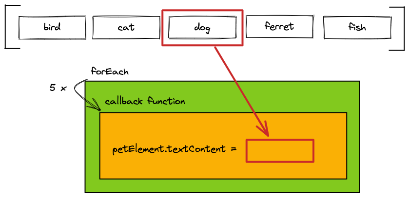
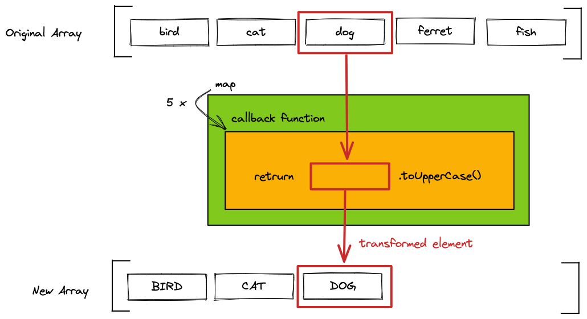
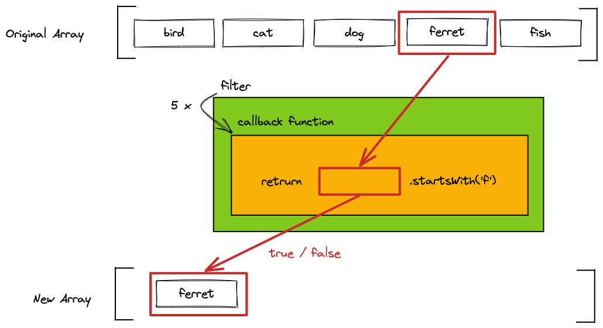

# JS Array-Methoden

## Lernziele

- Verständnis der Array-Iteration mit `forEach`
- Verständnis der Array-Iteration mit `map`
- Kenntnis des Unterschieds zwischen `forEach` und `map`
- Verwenden von `filter`, um Array-Elemente auszuschließen
- Verwenden von `document.querySelectorAll`

---

## Einführung in Array-Methoden

Alle hier vorgestellten Array-Methoden haben viel gemeinsam und können auf ähnliche Weise verwendet werden.

- Man übergibt eine Callback-Funktion mit einem Parameter
- Die Array-Methode iteriert über ein Array
- Die übergebene Callback-Funktion wird für jedes Element im Array aufgerufen
- Bei jedem Aufruf der Funktion wird das aktuelle Array-Element als erstes Argument übergeben

Auf diese Weise kann man Code schreiben und auf jedes Element innerhalb eines Arrays anwenden.

---

## `forEach`

Die Array-Methode `forEach` führt eine bestimmte Logik für jedes Element innerhalb eines Arrays aus.

```js
const pets = ["bird", "cat", "dog", "ferret", "fish"];
pets.forEach((pet) => {
  const petElement = document.createElement("p");
  petElement.textContent = pet;
  document.body.append(petElement);
});
```

> ❗️ Die Callback-Funktion, die an `forEach` übergeben wird, **darf nicht** das `return`-Statement verwenden. `forEach` >
> **gibt kein neues Array zurück**.

> ❗️ Man **sollte** `forEach` verwenden, um einen Nebeneffekt zu nutzen, wie `document.createElement`.



---

## `map`

Die Array-Methode `map` wird verwendet, um eine Transformation auf jedes Element eines Arrays anzuwenden.

Die transformierten Elemente werden im **neu erstellten Array** gespeichert, das von `map` zurückgegeben wird. Die Elemente im Original-Array werden nicht verändert.

Man kann die Art der Transformation, die auf jedes Element angewendet wird, in der Callback-Funktion definieren und das transformierte Element **zurückgeben**.

Das erstellte und das ursprüngliche Array haben die gleiche Länge.

```js
const pets = ["bird", "cat", "dog", "ferret", "fish"];
const uppercasePets = pets.map((pet) => {
  return pet.toUpperCase();
});
console.log(uppercasePets); // ['BIRD', 'CAT', 'DOG', 'FERRET', 'FISH']
```



❗️ Die Callback-Funktion, die an `map` übergeben wird, **muss** das `return`-Statement verwenden, um ein transformiertes Element zurückzugeben. `map` **gibt ein neues Array zurück.**

❗️ Man **sollte `map` nicht** verwenden, um einen Nebeneffekt zu verursachen, wie `document.createElement`.

---

## `filter``

Die Array-Methode `filter` wird verwendet, um **ein neues Array** mit einer Teilmenge der Elemente des ursprünglichen Arrays **zu erstellen**.

Die Callback-Funktion **gibt einen boolean-Wert zurück**, um zu definieren, ob ein Element im resultierenden Array enthalten ist oder nicht. Das ursprüngliche Array wird nicht verändert.

Das erstellte Array wird wahrscheinlich kürzer sein als das ursprüngliche Array.

```js
const pets = ["bird", "cat", "dog", "ferret", "fish"];
const petsWithF = pets.filter((pet) => {
  return pet.startsWith("f");
});
console.log(petsWithF); // ['ferret', 'fish']
```

> ❗️ Die Callback-Funktion, die an `filter` übergeben wird, **muss** das `return`-Statement verwenden, um einen boolean-Wert zurückzugeben.



---

## Verkettung von Array-Methoden

Oftmals muss man mehrere Array-Methoden kombinieren, um ein gewünschtes Ergebnis zu erzielen. Array-Methoden wie `map` und `filter`, die ein neues Array zurückgeben, können **verkettet** werden. Anstatt jedes Array in einer separaten Variablen zu speichern, können die Methoden direkt nacheinander aufgerufen werden. Dies reduziert die Menge des Codes und verbessert die Lesbarkeit.

```js
const pets = ["bird", "cat", "dog", "ferret", "fish"];
const uppercasePetsWithF = pets
  .filter((pet) => {
    return pet.startsWith("f");
  })
  .map((pet) => {
    return pet.toUpperCase();
  });
console.log(uppercasePetsWithF); // ['FERRET', 'FISH']
```

## `document.querySelectorAll``

Mit `document.querySelectorAll` kann man eine Liste von Elementen aus dem DOM auswählen. Dies steht im Gegensatz zu `document.querySelector`, das nur das erste Vorkommen eines Elements zurückgibt, das dem Selektor entspricht.

```js
const pets = document.querySelectorAll('[data-js="pet"]');
console.log(pets.length); // 5
```

Das `NodeList`, das von `document.querySelectorAll` zurückgegeben wird, ist ein array-ähnliches Objekt. Man kann die Methode `forEach` verwenden, um über die DOM-Elemente zu iterieren.

```js
const pets = document.querySelectorAll('[data-js="pet"]');
pets.forEach((pet) => {
  pet.addEventListener("click", () => {
    // [...]
  });
});
```

> ❗️ Ein `NodeList` ist kein Array! Andere Array-Methoden wie `map` oder `filter` können nicht verwendet werden. Wenn man Array-Methoden verwenden muss, kann man das `NodeList` mit `Array.from()` in ein Array konvertieren.

---

## Resources

- [MDN web docs: Array forEach](https://developer.mozilla.org/en-US/docs/Web/JavaScript/Reference/Global_Objects/Array/forEach)
- [MDN web docs: Array map](https://developer.mozilla.org/en-US/docs/Web/JavaScript/Reference/Global_Objects/Array/map)
- [MDN web docs: Array filter](https://developer.mozilla.org/en-US/docs/Web/JavaScript/Reference/Global_Objects/Array/filter)
- [MDN web docs: NodeList](https://developer.mozilla.org/en-US/docs/Web/API/NodeList)
