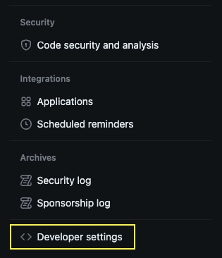
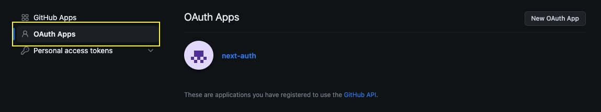
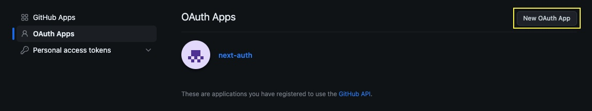

# Authentifizierung mit [NextAuth](https://next-auth.js.org/) und GitHub

## Lernziele

- Was ist Authentifizierung?
- Unterschied zwischen Authentifizierung und Autorisierung
- Wie man eine GitHub OAuth-App einrichtet
- Wie man NextAuth einrichtet

## Authentifizierung

Die Authentifizierung ist der Prozess der Überprüfung der Identität eines Benutzers, Geräts oder Systems, um sicherzustellen, dass sie das sind, was sie vorgeben zu sein. Im Kontext der Webentwicklung und Computersicherheit ist die Authentifizierung ein grundlegendes Konzept, das eine entscheidende Rolle beim Schutz von Daten und Ressourcen vor unbefugtem Zugriff spielt. Sie ist in der Regel Teil eines umfassenderen Sicherheitssystems, das auch Autorisierung und oft Verschlüsselung umfasst.

Hier sind die wichtigsten Komponenten und Konzepte der Authentifizierung:

1. **Benutzeridentität**: Die Authentifizierung beinhaltet in der Regel die Bestätigung der Identität eines Benutzers. Benutzer können ihre Identität durch etwas, das sie wissen (z. B. ein Passwort), etwas, das sie besitzen (z. B. eine Smartcard oder ein Sicherheitstoken), etwas, das sie sind (z. B. biometrische Daten wie Fingerabdrücke oder Retina-Scans), oder eine Kombination dieser Faktoren (zwei- oder mehrstufige Authentifizierung) nachweisen.

2. **Anmeldedaten**: Anmeldedaten sind Informationen, die ein Benutzer zur Identitätsüberprüfung bereitstellt. Häufige Beispiele sind Benutzernamen und Passwörter. Bei der Zwei-Faktor-Authentifizierung könnte einer der Faktoren ein einmaliger Code sein, der von einer mobilen App oder einem Hardware-Token generiert wird.

3. **Authentifizierungsmethoden**:

   - **Passwortbasierte Authentifizierung**: Benutzer geben einen Benutzernamen und ein Passwort ein.
   - **Biometrische Authentifizierung**: Verwendet physische Merkmale wie Fingerabdrücke, Gesichtserkennung oder Retina-Scans.
   - **Tokenbasierte Authentifizierung**: Benutzer erhalten einen zeitlich begrenzten Code per SMS, E-Mail oder über ein physisches Token.
   - **OAuth/OpenID Connect**: Ermöglicht es Benutzern, sich über einen externen Dienst wie Google oder Facebook zu authentifizieren.
   - **Zertifikate**: Digitale Zertifikate werden für eine starke Authentifizierung verwendet, oft im Zusammenhang mit einer Public-Key-Infrastruktur (PKI).

4. **Sitzungsverwaltung**: Nach erfolgreicher Authentifizierung wird eine Sitzung eingerichtet, um die Interaktionen eines Benutzers mit einer Webanwendung zu verfolgen. Diese Sitzung ermöglicht es dem Benutzer, auf geschützte Ressourcen zuzugreifen, ohne sich wiederholt authentifizieren zu müssen.

5. **Autorisierung**: Die Authentifizierung unterscheidet sich von der Autorisierung. Während die Authentifizierung die Identität überprüft, bestimmt die Autorisierung, welche Aktionen oder Ressourcen ein Benutzer nach der Authentifizierung ausführen oder darauf zugreifen darf.

6. **Sicherheitstoken**: Sichere Tokens wie JSON Web Tokens (JWT) werden häufig in Webanwendungen verwendet, um Benutzersitzungen zu verwalten und sicherzustellen, dass authentifizierte Benutzer auf autorisierte Ressourcen zugreifen können.

7. **Captive Portals**: In öffentlichen WLAN-Netzwerken können Benutzer zu einer Anmeldeseite (Captive Portal) weitergeleitet werden, auf der sie sich authentifizieren müssen, bevor sie auf das Internet zugreifen können.

Die Authentifizierung ist ein kritischer Aspekt der Websicherheit und des Datenschutzes. Das Versäumnis, eine ordnungsgemäße Authentifizierung zu implementieren, kann zu unbefugtem Zugriff, Datenlecks und anderen Sicherheitslücken führen. Webentwickler müssen geeignete Authentifizierungsmethoden auswählen, Benutzeranmeldedaten sicher handhaben und starke Passwortrichtlinien implementieren, um die Sicherheit von Webanwendungen zu gewährleisten.

## Authentifizierung vs. Autorisierung

Authentifizierung und Autorisierung sind zwei unterschiedliche, aber eng verwandte Konzepte im Bereich der Sicherheit, die oft zusammen verwendet werden, um den Zugriff auf Ressourcen zu steuern. Hier ist der Hauptunterschied zwischen den beiden:

1. **Authentifizierung**:

   - **Definition**: Die Authentifizierung ist der Prozess der Überprüfung der Identität eines Benutzers, Systems oder Geräts, um sicherzustellen, dass sie das sind, was sie vorgeben zu sein.
   - **Zweck**: Das Hauptziel der Authentifizierung besteht darin, die Identität der Entität, die Zugang anfordert, festzustellen.
   - **Methoden**: Die Authentifizierung erfolgt in der Regel durch die Vorlage von Anmeldedaten wie Benutzername und Passwort, biometrischen Daten (z. B. Fingerabdrücke), Sicherheitstokens oder anderen Faktoren, die die Identität bestätigen.
   - **Ergebnis**: Eine erfolgreiche Authentifizierung führt dazu, dass die Entität identifiziert wird und Zugang zum System erhält.
   - **Beispiel**: Wenn du dich mit deinem Benutzernamen und Passwort auf einer Website anmeldest, authentifiziert dich das System, indem es überprüft, ob die Anmeldedaten mit denen deines Kontos übereinstimmen.

2. **Autorisierung**:

   - **Definition**: Die Autorisierung ist der Prozess der Bestimmung, welche Aktionen, Ressourcen oder Daten ein authentifizierter Benutzer oder eine Entität zugreifen darf.
   - **Zweck**: Das Hauptziel der Autorisierung besteht darin, den Zugriff basierend auf den Berechtigungen und Privilegien des Benutzers zu steuern und einzuschränken.
   - **Methoden**: Die Autorisierung umfasst die Definition und Verwaltung von Zugriffsregeln, Berechtigungen und Richtlinien. Sie legt fest, auf welche Aktionen oder Ressourcen ein Benutzer zugreifen, ändern oder damit interagieren kann.
   - **Ergebnis**: Die Autorisierung legt fest, was eine authentifizierte Entität im System tun kann und setzt diese Regeln durch.
   - **Beispiel**: Nachdem du dich in einem System angemeldet hast (Authentifizierung), bestimmt das System, auf welche Teile der Anwendung du zugreifen kannst, welche Aktionen du ausführen und welche Daten du anzeigen oder ändern kannst (Autorisierung).

Zusammengefasst konzentriert sich die Authentifizierung auf die Bestätigung der Identität eines Benutzers oder einer Entität, während die Autorisierung den Zugriff und die Aktionen spezifiziert, die eine authentifizierte Entität durchführen kann. Beide Prozesse sind entscheidend für die Sicherheit, wobei die Authentifizierung der erste Schritt zur Feststellung der Identität des Benutzers ist und die Autorisierung bestimmt, was dieser authentifizierte Benutzer im System tun darf. Es ist üblich, sowohl Authentifizierungs- als auch Autorisierungsmechanismen zu implementieren, um eine ordnungsgemäße Zugriffskontrolle zu gewährleisten und sensible Informationen zu schützen.

## GitHub OAuth-App einrichten

1. Gehe zu den GitHub Developer Settings.

 

2. Klicke auf OAuth Apps.

 

3. Klicke auf New OAuth App.

 

4. Fülle das Formular aus:

   - Application name: `name-of-your-app`
   - Homepage URL: `http://localhost:3000`
   - Authorization callback URL: `http://localhost:3000/`

5. Klicke auf Register application.

6. Kopiere die Client-ID und das Client Secret.

7. Erstelle eine `.env.local` Datei im Root deines Projekts.

8. Füge folgendes zur `.env.local` Datei hinzu:

```bash
GITHUB_ID=your-client-id
GITHUB_SECRET=your-client-secret
```

> Denke daran, dass du, wenn du dein Projekt auf Vercel hostest, die OAuth-App aktualisieren musst, um die neue URL und die Callback-URL anzupassen.

## NextAuth einrichten

1. Folge der [NextAuth Getting Started](https://next-auth.js.org/getting-started/example) Anleitung.

   Stelle sicher, dass du Dateien und Ordner genau wie in der Anleitung benennst.

   Nachdem du deine App mit der `SessionProvider` Komponente umwickelt hast, sieht es so aus:

   ```jsx
   import { SessionProvider } from "next-auth/react";
   export default function App({
     Component,
     pageProps: { session, ...pageProps },
   }) {
     return (
       <SessionProvider session={session}>
         <Component {...pageProps} />
       </SessionProvider>
     );
   }
   ```

   Du kannst dann auf das Session-Objekt in deinen Pages so zugreifen:

   ```jsx
   import { useSession } from "next-auth/react";
   export default function Page() {
     const { data: session, status } = useSession();
     return (
       <div>
         <h1>Meine Seite</h1>
         {session && <p>Eingeloggt als {session.user.email}</p>}
         {!session && <p>Nicht eingeloggt</p>}
       </div>
     );
   }
   ```

## Einrichten eines MongoDB Adapters

1. Stelle sicher, dass du eine Datenbank auf [MongoDB Atlas](https://www.mongodb.com/cloud/atlas) hast. Aktualisiere deine `.env.local` Datei mit dem Verbindungs-String (`MONGODB_URI`).

2. Folge der [NextAuth MongoDB Adapter](https://next-auth.js.org/adapters/mongodb) Anleitung.

   Der MongoDB Adapter speichert die Benutzerdetails in einer `users` Collection, zusammen mit 2 anderen Collections: `sessions` und `accounts` in der Datenbank.

## Ändern des Standard-`session`-Objekts

1. In der `pages/auth/[...nextauth].js` Datei, füge das `callback`-Property in deinem `authOptions`-Objekt hinzu, so wie hier:

   ```js
   const authOptions = {
     providers: [
       Providers.GitHub({
         clientId: process.env.GITHUB_ID,
         clientSecret: process.env.GITHUB_SECRET,
       }),
     ],
     adapter: MongoDBAdapter(clientPromise),
     callbacks: {
       async session({ session, user }) {
         // Das User-Objekt aus der Datenbank enthält die ID des Benutzers in deiner Datenbank

         session.user.userId = user.id;

         // Mit dem obigen Code kannst du die Benutzer-ID zum Session-Objekt hinzufügen und sie in deinen Pages verwenden

         // Stelle sicher, dass du die session- und user-Objekte in der Konsole ausgibst, um zu sehen, was sie enthalten

         return session;
       },
     },
   };
   ```

## Wie man Eigenschaften zum Benutzerobjekt in der Datenbank hinzufügt

Du kannst dem Benutzerobjekt in der Datenbank Eigenschaften hinzufügen, indem du eine `profile`-Funktion zu deinem Provider-Objekt hinzufügst, so wie hier:

```js
const authOptions = {
  providers: [
    Providers.GitHub({
      clientId: process.env.GITHUB_ID,
      clientSecret: process.env.GITHUB_SECRET,
      profile(profile) {
        return {
          id: profile.id,
          // Diese ID ist erforderlich, wird aber nicht in deiner Users-Collection gespeichert
          name: profile.name,
          email: profile.email,
          image: profile.avatar_url,

          // Du kannst beliebige andere Eigenschaften zum Benutzerobjekt hinzufügen
          admin: false,
          preferedColors: ["#dddddd", "#ffffff"],
        };
      },
    }),
  ],
  adapter: MongoDBAdapter(clientPromise),
  callbacks: {
    async session({ session, user }) {
      session.user.userId = user.id;
      session.user.admin = user.admin;

      return session;
    },
  },
};
```

Stelle sicher, dass du dich immer auf die [NextAuth Dokumentation](https://next-auth.js.org/) beziehst, wenn du neue Features implementierst und um die neuesten Anwendungsbeispiele zu erhalten.
