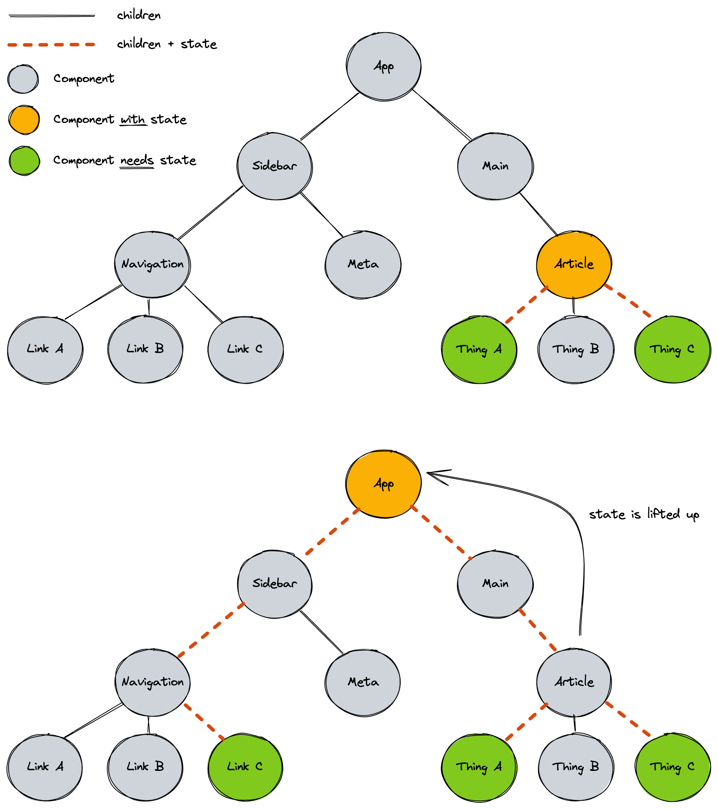

# React State 2

## Lernziele

- [ ] Wissen, wie man Formularfelder behandelt: kontrollierte Komponenten, unkontrollierte Komponenten
- [ ] Wissen, wie man Formular-Submit-Events behandelt
- [ ] Verstehen des Konzepts des "Lifting State Up"
- [ ] Wissen, wie man State und Funktionen über Props weitergibt
- [ ] Verstehen, dass State-Updates nicht synchron sind
- [ ] Wissen, was ein Hook in React ist und welche Regeln für Hooks gelten

---

## Zustand zwischen Komponenten teilen

### Zustand weitergeben

Der Wert einer State-Variable und die Setter-Funktion können an Kindkomponenten als Props weitergegeben werden. Sie sind Funktionen und Werte, daher können sie wie jede andere Datenart weitergegeben werden.

```js
function Parent() {
  const [count, setCount] = useState(0);

  function handleIncrement() {
    setCount(count + 1);
  }

  return <Child count={count} onIncrement={handleIncrement} />;
}
js
Code kopieren
function Child({ count, onIncrement }) {
  return (
    <>
      <p>Count: {count}</p>
      <button onClick={onIncrement}>increment</button>
    </>
  );
}
```

### Zustand nach oben heben

Wenn wir mehrere Komponenten haben, die denselben Zustand teilen müssen, können wir den Zustand in die Elternkomponente heben und als Props weitergeben. Dies wird als "Lifting State Up" bezeichnet, da man normalerweise mit dem Zustand direkt in der Kindkomponente beginnt und ihn dann nach oben zu den Elternkomponenten verschiebt, wenn er in immer mehr Komponenten benötigt wird.

Eine State-Variable kann an mehrere Kindkomponenten weitergegeben werden. Die Kindkomponenten können dann den Zustand durch Aufruf der Setter-Funktion aktualisieren.

Jede State-Variable sollte so tief wie möglich im Komponentenbaum leben, aber so hoch wie nötig. Wenn die gesamte `App` über die State-Variable Bescheid wissen muss, sollte sie in der `App`-Komponente leben. Wenn nur Kindkomponenten der `Article`-Komponente über die State-Variable Bescheid wissen müssen, sollte sie in der `Article`-Komponente leben.

Betrachten Sie das folgende Beispiel:



Hier sehen wir, dass ein `Link` in der `Navigation`-Komponente über einen Zustand Bescheid wissen muss, der zuvor in der `Article`-Komponente existierte. Wir können den Zustand in die `App`-Komponente heben und als Prop an die `Article`-Komponente weitergeben.

> 📙 Lesen Sie mehr über [**Zustand zwischen Komponenten teilen** in der React-Dokumentation](https://react.dev/learn/sharing-state-between-components).

## Umgang mit Formulardaten

### Verwenden von Formulardaten `onSubmit`

Wir können den `onSubmit`-Event-Handler verwenden, um Formulardaten zu verarbeiten. Der `onSubmit`-Event-Handler wird aufgerufen, wenn der Benutzer das Formular absendet. Wir können die Formulardaten (genau wie bei regulärem JavaScript) aus dem `Event`-Objekt abrufen.

```js
function SearchForm() {
  function handleSubmit(event) {
    event.preventDefault();
    const form = event.target;
    const searchTerm = form.elements.searchTerm.value;
    console.log("Ein neuer Suchbegriff wurde eingereicht:", searchTerm);
  }
  return (
    <form onSubmit={handleSubmit}>
      <label htmlFor="searchTerm">Suche</label>
      <input name="searchTerm" id="searchTerm" />
      <button>Suche</button>
    </form>
  );
}
```

In diesem Beispiel wird der Wert des Eingabefelds nicht manuell von React kontrolliert: Das Eingabefeld ist ein "unkontrolliertes Eingabefeld". Sein Wert wird vom Browser verwaltet. Im Submit-Event-Handler "blicken" wir einfach auf das Eingabefeld und lesen den Wert aus dem DOM.

### Verwendung von kontrollierten Eingaben

Wir können React verwenden, um den Wert eines Eingabefelds zu kontrollieren. Dies wird als "kontrolliertes Eingabefeld" bezeichnet. Das bedeutet, dass wir das Value-Attribut des Eingabefelds manuell setzen. Wir können eine State-Variable mit dem Value-Attribut des Eingabefelds verknüpfen. Auf diese Weise hat das Eingabefeld immer denselben Wert wie die State-Variable. Kombiniert mit dem `onChange`-Event-Handler können wir die State-Variable aktualisieren, wenn der Benutzer im Eingabefeld tippt.

```js
function SearchForm() {
  const [searchTerm, setSearchTerm] = useState("");

  function handleSubmit(event) {
    event.preventDefault();
    console.log("Ein neuer Suchbegriff wurde eingereicht:", searchTerm);
  }

  return (
    <form onSubmit={handleSubmit}>
      <label htmlFor="searchTerm">Suche</label>
      <input
        name="searchTerm"
        id="searchTerm"
        value={searchTerm}
        onChange={(event) => setSearchTerm(event.target.value)}
      />
      <button>Suche nach {searchTerm}</button>
    </form>
  );
}
```

In diesem Beispiel wissen Sie immer den Wert des Suchbegriff-Eingabefelds. Da es sich um eine State-Variable handelt, können Sie sie an anderen Stellen in Ihrer Anwendung verwenden. Sie sollten kontrollierte Eingaben verwenden, wenn möglich, aber manchmal müssen Sie ein kontrolliertes Eingabefeld nutzen.

Sie benötigen möglicherweise ein kontrolliertes Eingabefeld, wenn

- Suchergebnisse angezeigt werden sollen, während der Benutzer tippt,
- die Eingabe des Benutzers automatisch vervollständigt werden soll oder
- die Eingabe des Benutzers validiert werden soll.

## State-Updates sind nicht sofort

Wenn wir die Setter-Funktion einer State-Variable aufrufen, wird React die State-Variable nicht sofort aktualisieren. Stattdessen wird es den internen Wert aktualisieren und ein Neurendern der Komponente planen.

```js
// ⚠️ Dieser Code ist fehlerhaft!
function Counter() {
  const [count, setCount] = useState(0); // count ist anfänglich 0

  function handleIncrement() {
    // Wenn dies zuerst aufgerufen wird, ist count noch 0
    console.log(count); // → 0

    // Dies wird den internen Zustand von React auf 1 setzen,
    // aber die count-Variable nicht aktualisieren
    setCount(count + 1);
    console.log(count); // → 0

    // Die count-Variable ist immer noch 0, daher ist count + 1 immer noch 1,
    // also wird der interne Zustand von React immer noch 1 sein
    setCount(count + 1);
    console.log(count); // → 0

    // Da die Setter-Funktionen aufgerufen wurden,
    // wird React ein Neurendern der
    // Komponente mit dem neuen count-Wert von 1 planen
  }

  return (
    <>
      <p>Count: {count}</p>
      <button onClick={handleIncrement}>erhöhe um 2</button>
    </>
  );
}
```

Dieses Verhalten kann unerwartet sein, aber es ist wichtig zu verstehen, dass State-Variablen nicht sofort aktualisiert werden.

Es gibt einige Möglichkeiten, den obigen Code zu beheben. In diesem Beispiel könnten wir `setCount(count + 2)` aufrufen und fertig sein. Wenn wir aus irgendeinem Grund `setCount` zweimal aufrufen müssen, können wir die funktionale Form der Setter-Funktion verwenden, die den aktuellen internen Wert der State-Variable als Argument bereitstellt.

```js
// ⚠️ Dieser Code ist unnötig kompliziert, aber er funktioniert!
function Counter() {
  const [count, setCount] = useState(0); // count ist anfänglich 0

  function handleIncrement() {
    // Wenn dies zuerst aufgerufen wird, ist count noch 0
    console.log(count); // → 0

    // Dies wird den internen Zustand von React auf 1 setzen,
    // aber die count-Variable nicht aktualisieren
    setCount((prevCount) => prevCount + 1);
    console.log(count); // → 0

    // Der interne Wert von count ist 1,
    // wir erhalten ihn als ersten Parameter der Funktion, die wir an den Setter übergeben.
    // 1 + 1 ist 2, also wird der interne Zustand von React jetzt _2_ sein
    setCount((prevCount) => prevCount + 1);
    console.log(count); // → 0

    // Da die Setter-Funktionen aufgerufen wurden,
    // wird React ein Neurendern der
    // Komponente mit dem neuen count-Wert von _2_ planen
  }

  return (
    <>
      <p>Count: {count}</p>
      <button onClick={handleIncrement}>erhöhe um 2</button>
    </>
  );
}
```

> 💡 Hier wird das Präfix `prev` verwendet, um anzuzeigen, dass der Wert der vorherige Wert der State-Variable ist. Eine andere gängige Konvention ist, nur den ersten Buchstaben der State-Variable als Parametername zu verwenden: `setCount(c => c + 1)`.

> 📙 Lesen Sie mehr über [**Aktualisieren des Zustands basierend auf dem vorherigen Zustand**](https://react.dev/apis/react/useState#updating-state-based-on-the-previous-state) und [**Ich habe den Zustand aktualisiert, aber das Logging zeigt mir den alten Wert**](https://react.dev/apis/react/useState#ive-updated-the-state-but-logging-gives-me-the-old-value) in der React-Dokumentation.

## React Hooks

Die Funktion `useState` ist Teil eines breiteren Satzes von Features von React, die Komponenten zusätzliche Möglichkeiten bieten.

Hooks sind Funktionen, die es den Komponentenfunktionen ermöglichen, in React-Features (wie Zustand) einzuhaken und den Komponenten mehr zu ermöglichen, als eine traditionelle JavaScript-Funktion kann. Sie folgen der Namenskonvention `useXzy`.

Häufige Hooks, auf die Sie stoßen werden, sind `useState` und `useEffect`.

Beim Einsatz von Hooks müssen Sie einige Regeln beachten:

- Rufen Sie Hooks nur auf der obersten Ebene auf. Rufen Sie Hooks nicht in Schleifen, Bedingungen oder verschachtelten Funktionen auf.
- Rufen Sie Hooks nur von React-Funktionskomponenten oder benutzerdefinierten Hooks auf. Rufen Sie Hooks nicht von normalen JavaScript-Funktionen auf.

> 📙 Lesen Sie mehr über [**Hooks** in der React-Dokumentation](https://reactjs.org/docs/hooks-overview.html) von dem Zeitpunkt an, als sie in React eingeführt wurden.

---

## Resources

- [Sharing State Between Components in the React Docs](https://react.dev/learn/sharing-state-between-components)
- [Updating state based on the previous state in the React Docs](https://react.dev/reference/react/useState#updating-state-based-on-the-previous-state)
- [I’ve updated the state, but logging gives me the old value in the React Docs](https://react.dev/reference/react/useState#ive-updated-the-state-but-logging-gives-me-the-old-value)
- [Hooks at a Glance in the React Docs](https://reactjs.org/docs/hooks-overview.html)
